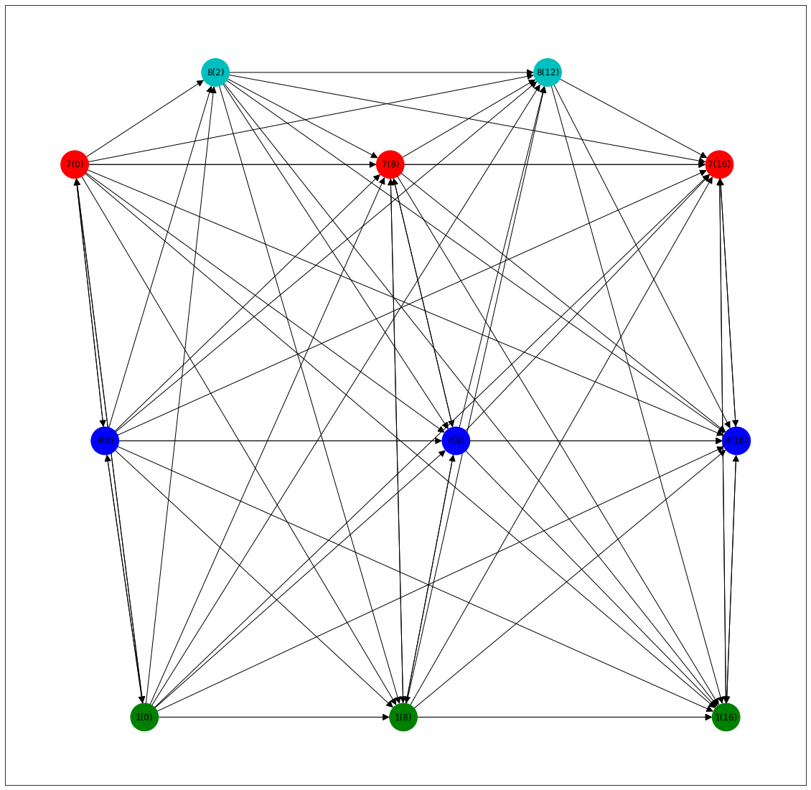
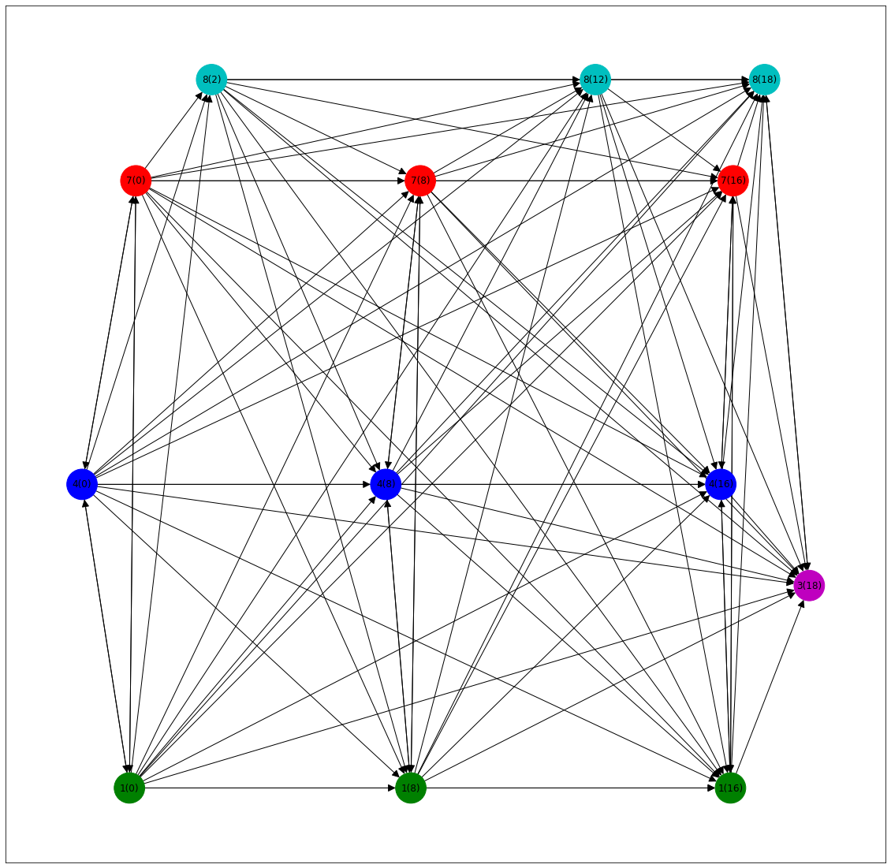
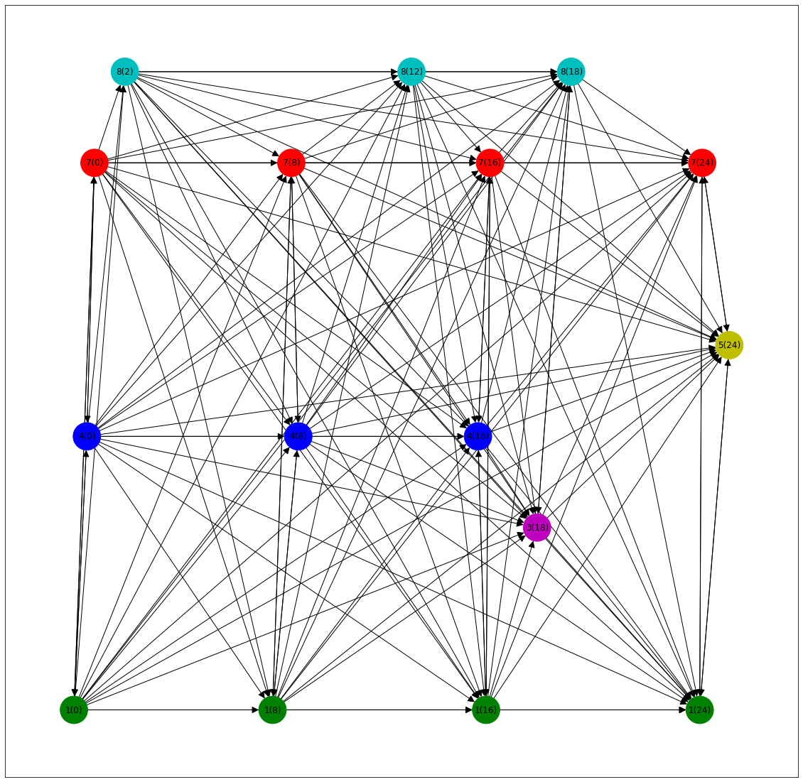
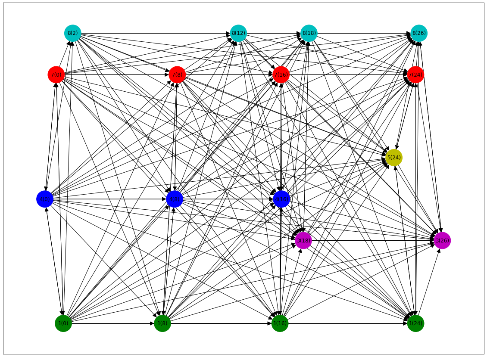

# Asynchronous Graph Generator
## Init repository
to replicate the `conda` environment used for this code run
~~~console
conda env create -f environment.yaml
~~~
You'll need to set up a local mongoDB to store all the pre-processing for rapid read-write. Once you've set that up the 
mongoDB config file can be found in the datareader paths e.g. `Datasets/Beijing/data/mongo_config.yaml`

config files take the form
~~~yaml
data_root: <data base root>
base: 'Activity'
host: '127.0.0.1'
port: 27017
~~~
## Run Activity training
To train the AGG using the activity dataset you can run 
~~~console
python train_activity.py -c ./activity_config.yaml
~~~
all hyper-parameters should be changed in the corresponding `activity_config.yaml`
schema file.

Similarly for the __PM2.5__ dataset (Beijing) with the run file names `train_pm25.py` and the corresponding config file 
called `pm25_config.yaml` 

## Conceptual Figures
### Step 5

### Step 6

### Step 7

### Step 8

### Step 9

https://github.com/zjuwuyy-DL/Generative-Semi-supervised-Learning-for-Multivariate-Time-Series-Imputation/blob/main/data_loader.py
