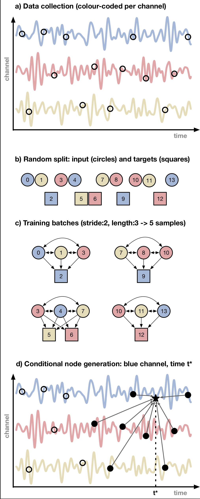

# Asynchronous Graph Generator
This is a repository for the code used in the paper ["Asynchronous Graph Generator"](https://arxiv.org/abs/2309.17335) by the authors

[Dr. Christopher P. Ley](https://www.linkedin.com/in/christopher-p-ley/) & Dr. Felipe Tobar.

## Abstract
We introduce the asynchronous graph generator (AGG), a novel graph attention network for imputation and prediction of
multi-channel time series. Free from recurrent components or assumptions about temporal/spatial regularity,
AGG encodes measurements, timestamps and channel-specific features directly in the nodes via learnable embeddings.
Through an attention mechanism, these embeddings allow for discovering expressive relationships among the variables of
interest in the form of a homogeneous graph. Once trained, AGG performs imputation by
_**conditional attention generation**_, i.e., by creating a new node conditioned on given timestamps and channel
specification. The proposed AGG is compared to related methods in the literature and its performance is analysed from a
data augmentation perspective. Our experiments reveal that AGG achieved state-of-the-art results in time series
imputation, classification and prediction for the benchmark datasets _Beijing Air Quality_,
_PhysioNet ICU 2012_ and _UCI localisation_, outperforming other recent attention-based networks.

## Conceptual Architecture

An illustration of the AGG self-supervised pipeline.

**a)** Time series samples are collected (possibly) asynchronously, and comprise measurements, timestamps and channel features.

**b)** Samples are ordered and a split into inputs and targets for self-supervised training.

**c)** The input/target split is considered as instances of the asynchronous graph for training.

**d)** The learnt graph encodes a rich representation of the underlying signal, where new samples to be generated through
_**conditional attention generation**_; here, $c_g = blue$ and $\tau_g = t_N - t_*$.

AGG model architecture: The sections of the network are indicated at the top of the figure. Inputs and target are
represented as circles and squares respectively, fixed operations are denoted by white blocks and learnable
transformations in light grey blocks.

## Init repository
to replicate the `conda` environment used for this code run
~~~console
conda env create -f environment.yaml
~~~
You'll need to set up a local mongoDB to store all the pre-processing for rapid read-write. Once you've set that up the
mongoDB config file can be found in the datareader paths e.g. `Datasets/Beijing/data/mongo_config.yaml`

config files for [mongo_config.yaml](Datasets/Beijing/data/mongo_config.yaml) take the form
~~~yaml
data_root: <data base root>
base: 'Beijing'
host: '127.0.0.1'
port: 27017
~~~

Note that data creation (preprocessing in to mongoDB) is done in the corresponding `datareader` modules for each dataset.
Depending on the configuration of the data augmentation, **_this will take a while!_**. Consider the sensitivity
analysis for the data augmentation [here](Datasets/Sensitivity_Analysis). As stride length gets smaller, the number of
samples generated increases (approximately) exponentially.

Stride length indirectly determines the number of samples generated for each dataset conceptually stride works as
described in the following diagram

